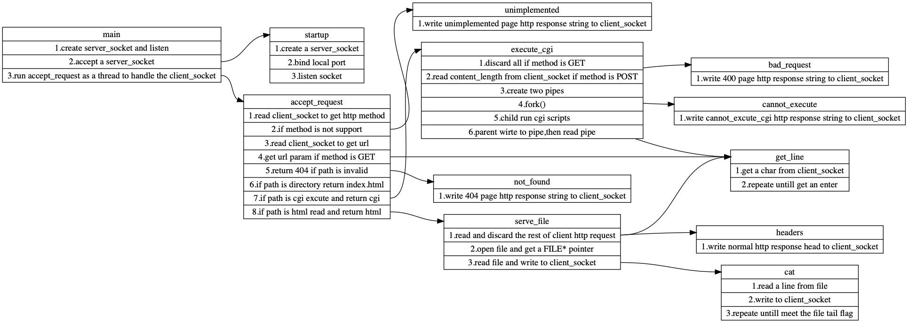

# httpserver学习

## 1.目的

通过研读一个简单的httpserver源码理解httpserver本质。

## 2.整体架构

从源码上看这个httpserver整体不足500行，入口是我们熟悉的网络编程server端的例子，只不过这里的client_socket回调函数有对http request的解析（仅仅支持get和post这两种请求的简单解析）。它的整体架构如下

## 3.结论

从这个项目中，我们可以知道：

1. 所谓httpserver其实就是处理client_socket的**回调函数**

2. 所谓的处理client_socket其实就是从socket中读http协议请求报文字符串，根据协议解析做不同的操作，然后用结果构造http协议响应报文字符串，最后写入socket，对socket的读写像极了文件IO

3. 所谓的静态网页就是，打开一个预先写好的html文件然后将html内容写入到http响应报文；所谓的cgi动态网页，其实是一个控制台程序，根据不同的input生成不同的output html页，这样即使访问同一个cgi页面，不同操作的用户会看到不同的界面